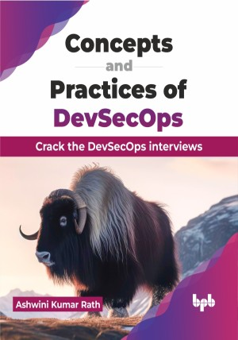

# Concepts and Practices of DevSecOps

Crack the DevSecOps interviews

This is the repository for [Concepts and Practices of DevSecOps
](https://bpbonline.com/products/concepts-and-practices-of-devsecops),published by BPB Publications.

## About the Book
DevOps took shape after the rapid evolution of agile methodologies and tools for managing different aspects of software development and IT operations. This resulted in a cultural shift and quick adoption of new methodologies and tools.

Start with the core principles of integrating security throughout software development lifecycles. Dive deep into application security, tackling vulnerabilities, and tools like JWT and OAuth. Subjugate multi-cloud infrastructure with DevSecOps on AWS, GCP, and Azure. Secure containerized applications by understanding vulnerabilities, patching, and best practices for Docker and Kubernetes. Automate and integrate your security with powerful tools. The book aims to provide a range of use cases, practical tips, and answers to a comprehensive list of 150+ questions drawn from software team war rooms and interview sessions.

After reading the book, you can confidently respond to questions on DevSecOps in interviews and work in a DevSecOps team effectively.

## What You Will Learn
• Seamlessly integrate security into your software development lifecycle.

• Address vulnerabilities and explore mitigation strategies.

• Master DevSecOps on AWS, GCP, and Azure, ensuring safety across cloud platforms.

• Learn about patching techniques and best practices for Docker and Kubernetes.

• Use powerful tools to centralize and streamline security management, boosting efficiency.

